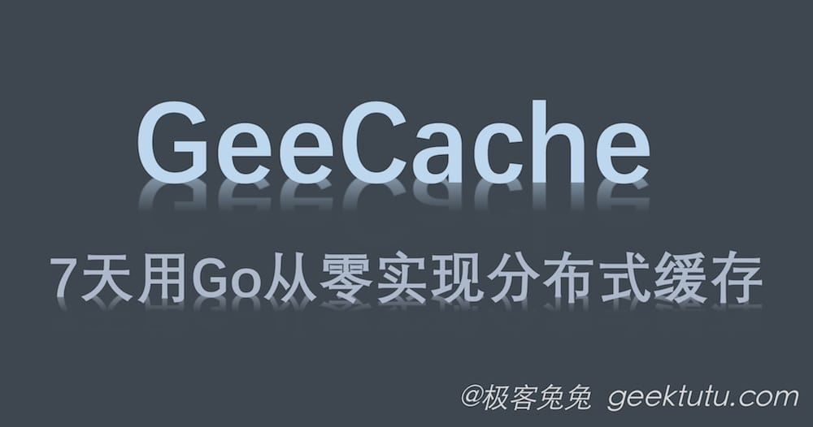

## 1 谈谈分布式缓存

第一次请求时将一些耗时操作的结果暂存，以后遇到相同的请求，直接返回暂存的数据。我想这是大部分童鞋对于缓存的理解。在计算机系统中，缓存无处不在，比如我们访问一个网页，网页和引用的 JS/CSS 等静态文件，根据不同的策略，会缓存在浏览器本地或是 CDN 服务器，那在第二次访问的时候，就会觉得网页加载的速度快了不少；比如微博的点赞的数量，不可能每个人每次访问，都从数据库中查找所有点赞的记录再统计，数据库的操作是很耗时的，很难支持那么大的流量，所以一般点赞这类数据是缓存在 Redis 服务集群中的。

> 商业世界里，现金为王；架构世界里，缓存为王。

缓存中最简单的莫过于存储在内存中的键值对缓存了。说到键值对，很容易想到的是字典(dict)类型，Go 语言中称之为 map。那直接创建一个 map，每次有新数据就往 map 中插入不就好了，这不就是键值对缓存么？这样做有什么问题呢？

1）内存不够了怎么办？

那就随机删掉几条数据好了。随机删掉好呢？还是按照时间顺序好呢？或者是有没有其他更好的淘汰策略呢？不同数据的访问频率是不一样的，优先删除访问频率低的数据是不是更好呢？数据的访问频率可能随着时间变化，那优先删除最近最少访问的数据可能是一个更好的选择。我们需要实现一个合理的淘汰策略。

2）并发写入冲突了怎么办？

对缓存的访问，一般不可能是串行的。map 是没有并发保护的，应对并发的场景，修改操作(包括新增，更新和删除)需要加锁。

3）单机性能不够怎么办？

单台计算机的资源是有限的，计算、存储等都是有限的。随着业务量和访问量的增加，单台机器很容易遇到瓶颈。如果利用多台计算机的资源，并行处理提高性能就要缓存应用能够支持分布式，这称为水平扩展(scale horizontally)。与水平扩展相对应的是垂直扩展(scale vertically)，即通过增加单个节点的计算、存储、带宽等，来提高系统的性能，硬件的成本和性能并非呈线性关系，大部分情况下，分布式系统是一个更优的选择。

4）...

## 2 关于 GeeCache

设计一个分布式缓存系统，需要考虑资源控制、淘汰策略、并发、分布式节点通信等各个方面的问题。而且，针对不同的应用场景，还需要在不同的特性之间权衡，例如，是否需要支持缓存更新？还是假定缓存在淘汰之前是不允许改变的。不同的权衡对应着不同的实现。

[groupcache](https://github.com/golang/groupcache) 是 Go 语言版的 memcached，目的是在某些特定场合替代 memcached。groupcache 的作者也是 memcached 的作者。无论是了解单机缓存还是分布式缓存，深入学习这个库的实现都是非常有意义的。

`GeeCache` 基本上模仿了 [groupcache](https://github.com/golang/groupcache) 的实现，为了将代码量限制在 500 行左右（groupcache 约 3000 行），裁剪了部分功能。但总体实现上，还是与 groupcache 非常接近的。支持特性有：

- 单机缓存和基于 HTTP 的分布式缓存
- 最近最少访问(Least Recently Used, LRU) 缓存策略
- 使用 Go 锁机制防止缓存击穿
- 使用一致性哈希选择节点，实现负载均衡
- 使用 protobuf 优化节点间二进制通信
- ...

`GeeCache` 分7天实现，每天完成的部分都是可以独立运行和测试的，就像搭积木一样，每天实现的特性组合在一起就是最终的分布式缓存系统。每天的代码在 100 行左右。

## 3 目录

- 第一天：[LRU 缓存淘汰策略](https://geektutu.com/post/geecache-day1.html) | [Code - Github](https://github.com/geektutu/7days-golang/blob/master/gee-cache/day1-lru)
- 第二天：[单机并发缓存](https://geektutu.com/post/geecache-day2.html) | [Code - Github](https://github.com/geektutu/7days-golang/blob/master/gee-cache/day2-single-node)
- 第三天：[HTTP 服务端](https://geektutu.com/post/geecache-day3.html) | [Code - Github](https://github.com/geektutu/7days-golang/blob/master/gee-cache/day3-http-server)
- 第四天：[一致性哈希(Hash)](https://geektutu.com/post/geecache-day4.html) | [Code - Github](https://github.com/geektutu/7days-golang/blob/master/gee-cache/day4-consistent-hash)
- 第五天：[分布式节点](https://geektutu.com/post/geecache-day5.html) | [Code - Github](https://github.com/geektutu/7days-golang/blob/master/gee-cache/day5-multi-nodes)
- 第六天：[防止缓存击穿](https://geektutu.com/post/geecache-day6.html) | [Code - Github](https://github.com/geektutu/7days-golang/blob/master/gee-cache/day6-single-flight)
- 第七天：[使用 Protobuf 通信](https://geektutu.com/post/geecache-day7.html) | [Code - Github](https://github.com/geektutu/7days-golang/blob/master/gee-cache/day7-proto-buf)

## 附 推荐阅读

- [Go 语言简明教程](https://geektutu.com/post/quick-golang.html)
- [Go Test 单元测试简明教程](https://geektutu.com/post/quick-go-test.html)
- [Go Protobuf 简明教程](https://geektutu.com/post/quick-go-protobuf.html)