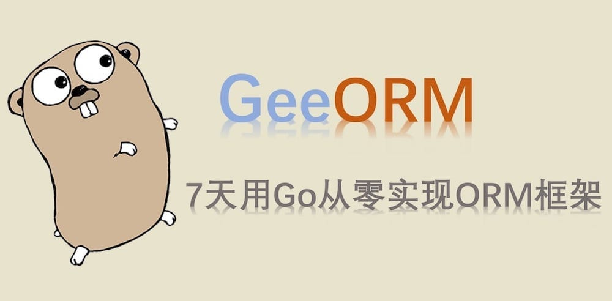

## 1 谈谈 ORM 框架

> 对象关系映射（Object Relational Mapping，简称ORM）是通过使用描述对象和数据库之间映射的元数据，将面向对象语言程序中的对象自动持久化到关系数据库中。

那对象和数据库是如何映射的呢？

| 数据库 | 面向对象的编程语言 | 
|:---:|:---:|
| 表(table) | 类(class/struct) |
| 记录(record, row) | 对象 (object) |
| 字段(field, column) | 对象属性(attribute) |

举一个具体的例子，来理解 ORM。

```sql
CREATE TABLE `User` (`Name` text, `Age` integer);
INSERT INTO `User` (`Name`, `Age`) VALUES ("Tom", 18);
SELECT * FROM `User`;
```

第一条 SQL 语句，在数据库中创建了表 `User`，并且定义了 2 个字段 `Name` 和 `Age`；第二条 SQL 语句往表中添加了一条记录；最后一条语句返回表中的所有记录。

假如我们使用了 ORM 框架，可以这么写：

```go
type User struct {
    Name string
    Age  int
}

orm.CreateTable(&User{})
orm.Save(&User{"Tom", 18})
var users []User
orm.Find(&users)
```

ORM 框架相当于对象和数据库中间的一个桥梁，借助 ORM 可以避免写繁琐的 SQL 语言，仅仅通过操作具体的对象，就能够完成对关系型数据库的操作。

那如何实现一个 ORM 框架呢？

- `CreateTable` 方法需要从参数 `&User{}` 得到对应的结构体的名称 User 作为表名，成员变量 Name, Age 作为列名，同时还需要知道成员变量对应的类型。
- `Save` 方法则需要知道每个成员变量的值。
- `Find` 方法仅从传入的空切片 `&[]User`，得到对应的结构体名也就是表名 User，并从数据库中取到所有的记录，将其转换成 User 对象，添加到切片中。

如果这些方法只接受 User 类型的参数，那是很容易实现的。但是 ORM 框架是通用的，也就是说可以将任意合法的对象转换成数据库中的表和记录。例如：

```go
type Account struct {
    Username string
    Password string
}

orm.CreateTable(&Account{})
```

这就面临了一个很重要的问题：如何根据任意类型的指针，得到其对应的结构体的信息。这涉及到了 Go 语言的反射机制(reflect)，通过反射，可以获取到对象对应的结构体名称，成员变量、方法等信息，例如：

```go
typ := reflect.Indirect(reflect.ValueOf(&Account{})).Type()
fmt.Println(typ.Name()) // Account

for i := 0; i < typ.NumField(); i++ {
    field := typ.Field(i)
    fmt.Println(field.Name) // Username Password
}
```

- `reflect.ValueOf()` 获取指针对应的反射值。
- `reflect.Indirect()` 获取指针指向的对象的反射值。
- `(reflect.Type).Name()` 返回类名(字符串)。
- `(reflect.Type).Field(i)` 获取第 i 个成员变量。

除了对象和表结构/记录的映射以外，设计 ORM 框架还需要关注什么问题呢？

1）MySQL，PostgreSQL，SQLite 等数据库的 SQL 语句是有区别的，ORM 框架如何在开发者不感知的情况下适配多种数据库？

2）如何对象的字段发生改变，数据库表结构能够自动更新，即是否支持数据库自动迁移(migrate)？

3）数据库支持的功能很多，例如事务(transaction)，ORM 框架能实现哪些？

4）...

## 2 关于 GeeORM

数据库的特性非常多，简单的增删查改使用 ORM 替代 SQL 语句是没有问题的，但是也有很多特性难以用 ORM 替代，比如复杂的多表关联查询，ORM 也可能支持，但是基于性能的考虑，开发者自己写 SQL 语句很可能更高效。

因此，设计实现一个 ORM 框架，就需要给功能特性排优先级了。

Go 语言中使用比较广泛 ORM 框架是 [gorm](https://github.com/jinzhu/gorm) 和 [xorm](https://github.com/go-xorm/xorm)。除了基础的功能，比如表的操作，记录的增删查改，gorm 还实现了关联关系(一对一、一对多等)，回调插件等；xorm 实现了读写分离(支持配置多个数据库)，数据同步，导入导出等。

gorm 正在彻底重构 v1 版本，短期内看不到发布 v2 的可能。相比于 gorm-v1，xorm 在设计上更清晰。GeeORM 的设计主要参考了 xorm，一些细节上的实现参考了 gorm。GeeORM 的目的主要是了解 ORM 框架设计的原理，具体实现上鲁棒性做得不够，一些复杂的特性，例如 gorm 的关联关系，xorm 的读写分离没有实现。目前支持的特性有：

- 表的创建、删除、迁移。
- 记录的增删查改，查询条件的链式操作。
- 单一主键的设置(primary key)。
- 钩子(在创建/更新/删除/查找之前或之后)
- 事务(transaction)。
- ...

`GeeORM` 分7天实现，每天完成的部分都是可以独立运行和测试的，就像搭积木一样，一个个独立的特性组合在一起就是最终的 ORM 框架。每天的代码在 100 行左右，同时配有较为完备的单元测试用例。

## 3 目录

- 第一天：database/sql 基础 | [Code](https://github.com/geektutu/7days-golang/blob/master/gee-orm/day1-database-sql)
- 第二天：对象表结构映射 | [Code](https://github.com/geektutu/7days-golang/blob/master/gee-orm/day2-reflect-schema)
- 第三天：插入/查询记录 | [Code](https://github.com/geektutu/7days-golang/blob/master/gee-orm/day3-save-query)
- 第四天：链式操作与更新删除 | [Code](https://github.com/geektutu/7days-golang/blob/master/gee-orm/day4-chain-operation)
- 第五天：实现钩子(Hooks) | [Code](https://github.com/geektutu/7days-golang/blob/master/gee-orm/day5-hooks)
- 第六天：支持事务(Transaction) | [Code](https://github.com/geektutu/7days-golang/blob/master/gee-orm/day6-transaction)
- 第七天：数据库迁移(Migrate) | [Code](https://github.com/geektutu/7days-golang/blob/master/gee-orm/day7-migrate)


## 附 推荐阅读

- [Go 语言简明教程](https://geektutu.com/post/quick-golang.html)
- [Go Test 单元测试简明教程](https://geektutu.com/post/quick-go-test.html)
- [SQLite 常用命令速查表](https://geektutu.com/post/cheat-sheet-sqlite.html)