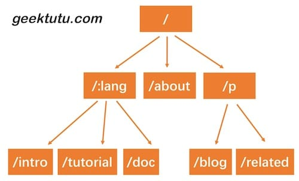

本文是 [7天用Go从零实现Web框架Gee教程系列](https://geektutu.com/post/gee.html)的第三篇。

- 使用 Trie 树实现动态路由(dynamic route)解析。
- 支持两种模式`:name`和`*filepath`，**代码约150行**。

## Trie 树简介

之前，我们用了一个非常简单的`map`结构存储了路由表，使用`map`存储键值对，索引非常高效，但是有一个弊端，键值对的存储的方式，只能用来索引静态路由。那如果我们想支持类似于`/hello/:name`这样的动态路由怎么办呢？所谓动态路由，即一条路由规则可以匹配某一类型而非某一条固定的路由。例如`/hello/:name`，可以匹配`/hello/geektutu`、`hello/jack`等。

动态路由有很多种实现方式，支持的规则、性能等有很大的差异。例如开源的路由实现`gorouter`支持在路由规则中嵌入正则表达式，例如`/p/[0-9A-Za-z]+`，即路径中的参数仅匹配数字和字母；另一个开源实现`httprouter`就不支持正则表达式。著名的Web开源框架`gin` 在早期的版本，并没有实现自己的路由，而是直接使用了`httprouter`，后来不知道什么原因，放弃了`httprouter`，自己实现了一个版本。


实现动态路由最常用的数据结构，被称为前缀树(Trie树)。看到名字你大概也能知道前缀树长啥样了：每一个节点的所有的子节点都拥有相同的前缀。这种结构非常适用于路由匹配，比如我们定义了如下路由规则：

- /:lang/doc
- /:lang/tutorial
- /:lang/intro
- /about
- /p/blog
- /p/related

我们用前缀树来表示，是这样的。



HTTP请求的路径恰好是由`/`分隔的多段构成的，因此，每一段可以作为前缀树的一个节点。我们通过树结构查询，如果中间某一层的节点都不满足条件，那么就说明没有匹配到的路由，查询结束。

接下来我们实现的动态路由具备以下两个功能。

- 参数匹配`:`。例如 `/p/:lang/doc`，可以匹配 `/p/c/doc` 和 `/p/go/doc`。
- 通配`*`。例如 `/static/*filepath`，可以匹配`/static/fav.ico`，也可以匹配`/static/js/jQuery.js`，这种模式常用于静态服务器，能够递归地匹配子路径。

## Trie 树实现

首先我们需要设计树节点上应该存储那些信息。

**[day3-router/gee/trie.go](https://github.com/geektutu/7days-golang/tree/master/gee-web/day3-router)**

```go
type node struct {
	pattern  string // 待匹配路由，例如 /p/:lang
	part     string // 路由中的一部分，例如 :lang
	children []*node // 子节点，例如 [doc, tutorial, intro]
	isWild   bool // 是否精确匹配，part 含有 : 或 * 时为true
}
```

与普通的树不同，为了实现动态路由匹配，加上了`isWild`这个参数。即当我们匹配 `/p/go/doc/`这个路由时，第一层节点，`p`精准匹配到了`p`，第二层节点，`go`模糊匹配到`:lang`，那么将会把`lang`这个参数赋值为`go`，继续下一层匹配。我们将匹配的逻辑，包装为一个辅助函数。

```go
// 第一个匹配成功的节点，用于插入
func (n *node) matchChild(part string) *node {
	for _, child := range n.children {
		if child.part == part || child.isWild {
			return child
		}
	}
	return nil
}
// 所有匹配成功的节点，用于查找
func (n *node) matchChildren(part string) []*node {
	nodes := make([]*node, 0)
	for _, child := range n.children {
		if child.part == part || child.isWild {
			nodes = append(nodes, child)
		}
	}
	return nodes
}
```

对于路由来说，最重要的当然是注册与匹配了。开发服务时，注册路由规则，映射handler；访问时，匹配路由规则，查找到对应的handler。因此，Trie 树需要支持节点的插入与查询。插入功能很简单，递归查找每一层的节点，如果没有匹配到当前`part`的节点，则新建一个，有一点需要注意，`/p/:lang/doc`只有在第三层节点，即`doc`节点，`pattern`才会设置为`/p/:lang/doc`。`p`和`:lang`节点的`pattern`属性皆为空。因此，当匹配结束时，我们可以使用`n.pattern == ""`来判断路由规则是否匹配成功。例如，`/p/python`虽能成功匹配到`:lang`，但`:lang`的`pattern`值为空，因此匹配失败。查询功能，同样也是递归查询每一层的节点，退出规则是，匹配到了`*`，匹配失败，或者匹配到了第`len(parts)`层节点。

```go
func (n *node) insert(pattern string, parts []string, height int) {
	if len(parts) == height {
		n.pattern = pattern
		return
	}

	part := parts[height]
	child := n.matchChild(part)
	if child == nil {
		child = &node{part: part, isWild: part[0] == ':' || part[0] == '*'}
		n.children = append(n.children, child)
	}
	child.insert(pattern, parts, height+1)
}

func (n *node) search(parts []string, height int) *node {
	if len(parts) == height || strings.HasPrefix(n.part, "*") {
		if n.pattern == "" {
			return nil
		}
		return n
	}

	part := parts[height]
	children := n.matchChildren(part)

	for _, child := range children {
		result := child.search(parts, height+1)
		if result != nil {
			return result
		}
	}

	return nil
}
```

## Router

Trie 树的插入与查找都成功实现了，接下来我们将 Trie 树应用到路由中去吧。我们使用 roots 来存储每种请求方式的Trie 树根节点。使用 handlers 存储每种请求方式的 HandlerFunc 。getRoute 函数中，还解析了`:`和`*`两种匹配符的参数，返回一个 map 。例如`/p/go/doc`匹配到`/p/:lang/doc`，解析结果为：`{lang: "go"}`，`/static/css/geektutu.css`匹配到`/static/*filepath`，解析结果为`{filepath: "css/geektutu.css"}`。

**day3-router/gee/router.go**

```go
type router struct {
	roots    map[string]*node
	handlers map[string]HandlerFunc
}

// roots key eg, roots['GET'] roots['POST']
// handlers key eg, handlers['GET-/p/:lang/doc'], handlers['POST-/p/book']
    
func newRouter() *router {
	return &router{
		roots:    make(map[string]*node),
		handlers: make(map[string]HandlerFunc),
	}
}

// Only one * is allowed
func parsePattern(pattern string) []string {
	vs := strings.Split(pattern, "/")

	parts := make([]string, 0)
	for _, item := range vs {
		if item != "" {
			parts = append(parts, item)
			if item[0] == '*' {
				break
			}
		}
	}
	return parts
}

func (r *router) addRoute(method string, pattern string, handler HandlerFunc) {
	parts := parsePattern(pattern)

	key := method + "-" + pattern
	_, ok := r.roots[method]
	if !ok {
		r.roots[method] = &node{}
	}
	r.roots[method].insert(pattern, parts, 0)
	r.handlers[key] = handler
}

func (r *router) getRoute(method string, path string) (*node, map[string]string) {
	searchParts := parsePattern(path)
	params := make(map[string]string)
	root, ok := r.roots[method]

	if !ok {
		return nil, nil
	}

	n := root.search(searchParts, 0)

	if n != nil {
		parts := parsePattern(n.pattern)
		for index, part := range parts {
			if part[0] == ':' {
				params[part[1:]] = searchParts[index]
			}
			if part[0] == '*' && len(part) > 1 {
				params[part[1:]] = strings.Join(searchParts[index:], "/")
				break
			}
		}
		return n, params
	}

	return nil, nil
}
```

## Context与handle的变化

在 HandlerFunc 中，希望能够访问到解析的参数，因此，需要对 Context 对象增加一个属性和方法，来提供对路由参数的访问。我们将解析后的参数存储到`Params`中，通过`c.Param("lang")`的方式获取到对应的值。

**day3-router/gee/context.go**

```go
type Context struct {
	// origin objects
	Writer http.ResponseWriter
	Req    *http.Request
	// request info
	Path   string
	Method string
	Params map[string]string
	// response info
	StatusCode int
}

func (c *Context) Param(key string) string {
	value, _ := c.Params[key]
	return value
}
```

**day3-router/gee/router.go**

```go
func (r *router) handle(c *Context) {
	n, params := r.getRoute(c.Method, c.Path)
	if n != nil {
		c.Params = params
		key := c.Method + "-" + n.pattern
		r.handlers[key](c)
	} else {
		c.String(http.StatusNotFound, "404 NOT FOUND: %s\n", c.Path)
	}
}
```

`router.go`的变化比较小，比较重要的一点是，在调用匹配到的`handler`前，将解析出来的路由参数赋值给了`c.Params`。这样就能够在`handler`中，通过`Context`对象访问到具体的值了。

## 单元测试

```go
func newTestRouter() *router {
	r := newRouter()
	r.addRoute("GET", "/", nil)
	r.addRoute("GET", "/hello/:name", nil)
	r.addRoute("GET", "/hello/b/c", nil)
	r.addRoute("GET", "/hi/:name", nil)
	r.addRoute("GET", "/assets/*filepath", nil)
	return r
}

func TestParsePattern(t *testing.T) {
	ok := reflect.DeepEqual(parsePattern("/p/:name"), []string{"p", ":name"})
	ok = ok && reflect.DeepEqual(parsePattern("/p/*"), []string{"p", "*"})
	ok = ok && reflect.DeepEqual(parsePattern("/p/*name/*"), []string{"p", "*name"})
	if !ok {
		t.Fatal("test parsePattern failed")
	}
}

func TestGetRoute(t *testing.T) {
	r := newTestRouter()
	n, ps := r.getRoute("GET", "/hello/geektutu")

	if n == nil {
		t.Fatal("nil shouldn't be returned")
	}

	if n.pattern != "/hello/:name" {
		t.Fatal("should match /hello/:name")
	}

	if ps["name"] != "geektutu" {
		t.Fatal("name should be equal to 'geektutu'")
	}

	fmt.Printf("matched path: %s, params['name']: %s\n", n.pattern, ps["name"])

}
```

## 使用Demo

看看框架使用的样例吧。

**day3-router/main.go**

```go
func main() {
	r := gee.New()
	r.GET("/", func(c *gee.Context) {
		c.HTML(http.StatusOK, "<h1>Hello Gee</h1>")
	})

	r.GET("/hello", func(c *gee.Context) {
		// expect /hello?name=geektutu
		c.String(http.StatusOK, "hello %s, you're at %s\n", c.Query("name"), c.Path)
	})

	r.GET("/hello/:name", func(c *gee.Context) {
		// expect /hello/geektutu
		c.String(http.StatusOK, "hello %s, you're at %s\n", c.Param("name"), c.Path)
	})

	r.GET("/assets/*filepath", func(c *gee.Context) {
		c.JSON(http.StatusOK, gee.H{"filepath": c.Param("filepath")})
	})

	r.Run(":9999")
}
```

使用`curl`工具，测试结果。

```bash
$ curl "http://localhost:9999/hello/geektutu"
hello geektutu, you're at /hello/geektutu

$ curl "http://localhost:9999/assets/css/geektutu.css"
{"filepath":"css/geektutu.css"}
```